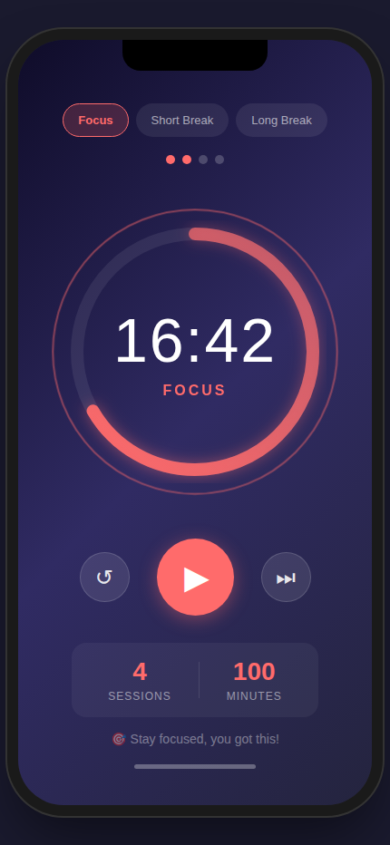

# 🍅 Focus Timer

> A beautiful, minimalist Pomodoro timer app to supercharge your productivity.

<p align="center">
  
</p>

## ✨ Features

### ⏱️ Pomodoro Technique
- **25-minute focus sessions** to maximize deep work
- **5-minute short breaks** to recharge
- **15-minute long breaks** after 4 cycles
- Automatic cycle tracking with visual indicators

### 🎨 Beautiful Design
- Stunning gradient backgrounds
- Animated circular progress ring with glow effects
- Smooth animations and haptic feedback
- Dark mode optimized for eye comfort

### 📊 Track Your Progress
- Daily session counter
- Total focus minutes tracked
- Persistent stats across sessions
- Visual cycle completion indicators

### 🔔 Stay on Track
- Push notifications when timer completes
- Background timer support
- Works even when app is minimized

## 📱 Screenshots

<p align="center">
  
</p>

## 💰 Pricing

| Tier | Price | Features |
|------|-------|----------|
| **Free** | $0 | Basic timer, daily stats, ads |
| **Pro** | $4.99 (one-time) | No ads, custom themes, widgets, custom durations |

## 🛠️ Tech Stack

- **React Native** + **Expo** - Cross-platform mobile development
- **Zustand** - Lightweight state management
- **Reanimated** - Smooth 60fps animations
- **AdMob** - Non-intrusive advertising
- **RevenueCat** - In-app purchases

## 🚀 Getting Started

```bash
# Install dependencies
npm install

# Start development server
npx expo start

# Run on iOS simulator
npx expo run:ios

# Run on Android emulator
npx expo run:android
```

## 📁 Project Structure

```
focus-timer/
├── src/
│   ├── app/           # Main screens
│   ├── store/         # Zustand state management
│   └── utils/         # Notifications, helpers
├── assets/            # Images, fonts
└── screenshots/       # App screenshots
```

## 📄 License

MIT © [bendudebot](https://github.com/bendudebot)

---

<p align="center">
  Made with ❤️ and lots of ☕
</p>
